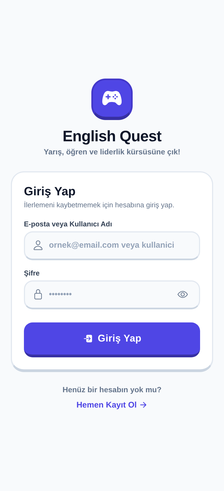
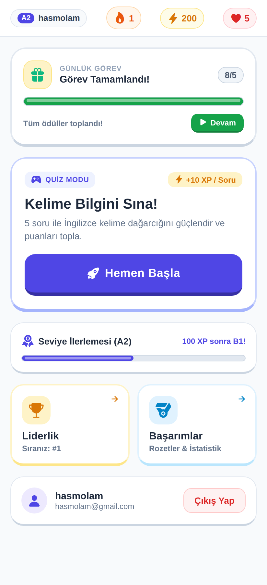
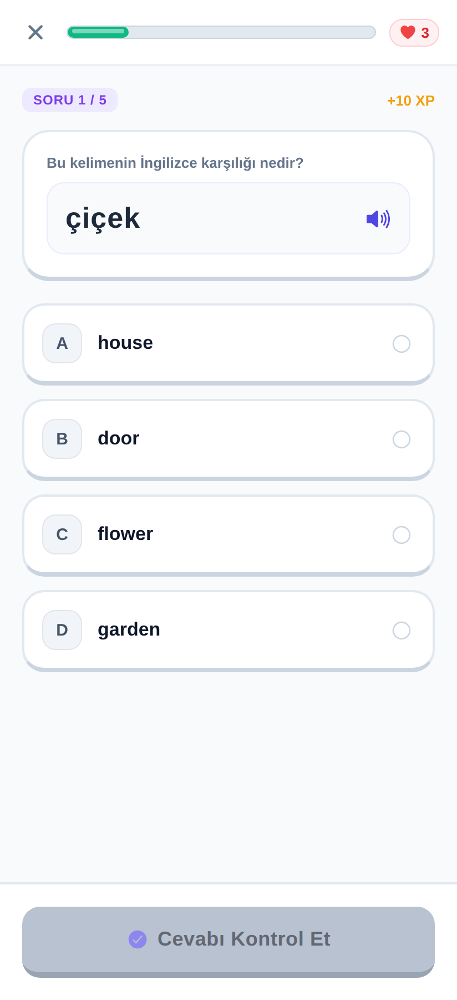
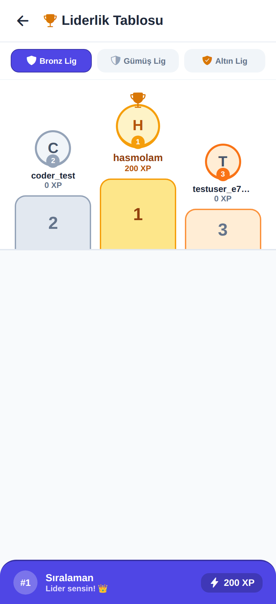
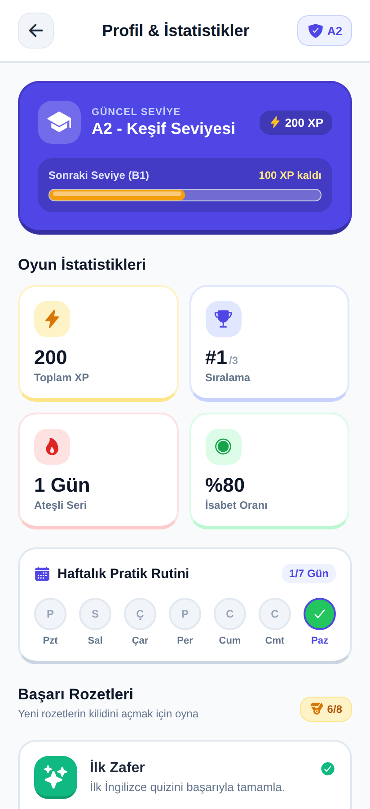
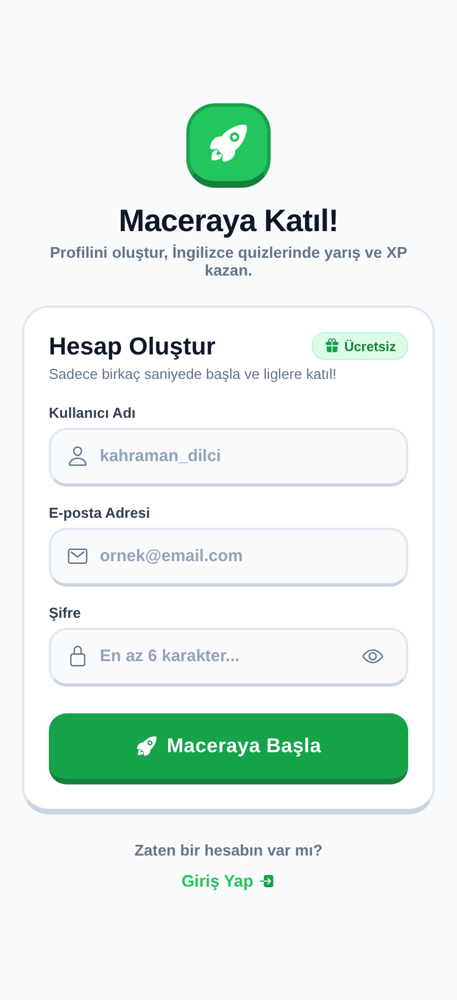
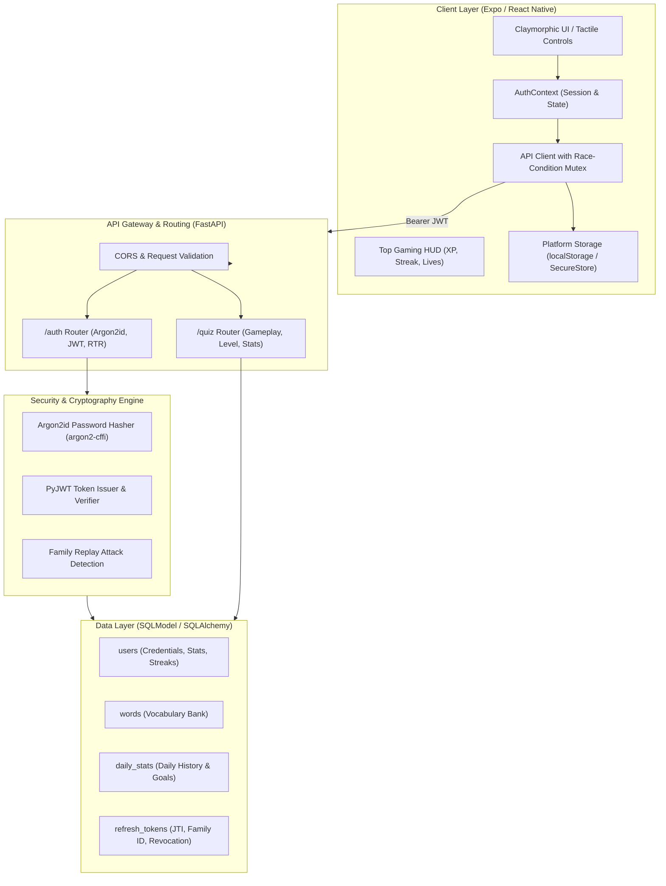

# English Quiz App 🎮 ⚡

[](https://fastapi.tiangolo.com)
[](https://reactnative.dev)
[](https://expo.dev)
[](https://www.typescriptlang.org)
[](https://www.python.org)
[](https://docs.astral.sh/uv/)
[](https://opensource.org/licenses/MIT)
[](https://datatracker.ietf.org/doc/html/rfc9106)
[](https://auth0.com/docs/secure/tokens/refresh-tokens/refresh-token-rotation)

> **English Quiz App** is a production-grade, gamified English vocabulary learning and competition platform inspired by Duolingo and Kahoot. Built with **React Native (Expo)** on the frontend and **FastAPI (SQLModel)** on the backend, it features a complete bespoke authentication suite (Argon2id + JWT Refresh Token Rotation) and an arcade-style 3D tactile user interface.

---

## 📱 Application Preview

| Sign In (3D Tactile) | Dashboard & Live HUD | Quiz Arena |
| :---: | :---: | :---: |
|  |  |  |

| 3D Podium Leaderboard | Live Stats & Badges | Sign Up |
| :---: | :---: | :---: |
|  |  |  |

---

## 📸 Key Highlights

- **Arcade Claymorphic UI:** Tactile 3D pushable buttons (`active:translate-y-1`), glossy progress bars, and vibrant visual hierarchy designed according to modern mobile accessibility and touch ergonomics.
- **Top Gaming HUD:** Persistent status bar displaying User Tier Badge (`A1` through `C1`), Flame Streak counter (`🔥`), XP Star counter (`⚡`), and remaining Heart Lives (`❤️`).
- **Dynamic CEFR Progression Roadmap:** Real-time XP tracking aligned with the Common European Framework of Reference for Languages (A1: 0–99 XP, A2: 100–299 XP, B1: 300–599 XP, B2: 600–999 XP, C1: 1000+ XP).
- **Duolingo-Style Instant Feedback:** Animated bottom drawer providing instant positive/negative feedback, combo multipliers, mistake review, and pronunciation hints.
- **3-Tier Podium Leaderboard:** Olympic-style podium for the Top 3 learners with gold crown, silver and bronze pedestals, competitive league tiers (Bronze, Silver, Gold), and sticky current-user ranking.
- **Database-Driven Achievement Engine:** 100% real-time achievement unlocks calculated directly from verified database gameplay records (no mock data).
- **Enterprise-Grade Security:** Replaces external identity providers with an in-house Argon2id password hashing engine, short-lived JWT Access Tokens, family-based Refresh Token Rotation with automatic Replay Attack invalidation, and client-side Race Condition Mutex handling.

---

## 🏛 System Architecture



---

## 🛡️ Security Architecture Deep Dive

### 1. Argon2id Password Hashing
Rather than relying on legacy algorithms (MD5, SHA-256) or memory-constrained bcrypt, this application adopts **Argon2id** (winner of the Password Hashing Competition, RFC 9106) via `argon2-cffi`. Argon2id provides maximum resistance against both GPU brute-force attacks and side-channel timing attacks.

### 2. JWT Access Token + Refresh Token Rotation (RTR)
- **Short-Lived Access Token:** 1-hour expiration time containing authenticated user identity (`sub`, `username`, `jti`, `type: access`).
- **Long-Lived Refresh Token:** 30-day expiration time stored in the database with unique `jti` and `family_id`.
- **Automatic Rotation:** Every invocation of `/auth/refresh` revokes the incoming refresh token and issues a brand-new access/refresh token pair.

### 3. Family-Based Replay Attack Mitigation
If an attacker intercepts an already-used refresh token and attempts to replay it:
1. The backend detects that a token with `is_revoked == True` is being reused.
2. The security engine automatically flags a potential breach.
3. **All active tokens belonging to that `family_id` are instantly revoked**, terminating all compromised sessions immediately.

### 4. Client-Side Concurrency Mutex
When a user launches multiple concurrent requests with an expired access token, naive clients fire multiple simultaneous refresh calls, causing race conditions where subsequent requests use already-rotated tokens and get rejected.
Our client implementation in [`frontend/utils/api.ts`](file:///home/hasmolam/Workspaces/Work/englishquizapp/frontend/utils/api.ts) utilizes a **promise-chaining Mutex queue**:
- The first request initiates the single token refresh call.
- Subsequent parallel requests queue up and await the resolution of that single refresh promise.
- All requests replay cleanly with the newly acquired access token.

### 5. Platform-Safe Storage Abstraction
[`frontend/utils/storage.ts`](file:///home/hasmolam/Workspaces/Work/englishquizapp/frontend/utils/storage.ts) provides a unified asynchronous storage API:
- **Web:** Utilizes browser `localStorage`.
- **Native (iOS/Android):** Utilizes hardware-backed `expo-secure-store` (Keychain on iOS, EncryptedSharedPreferences on Android).

---

## 🎨 UI/UX & Gamification Design System

Built according to the `ui-ux-pro-max` design intelligence guidelines:

| Visual Element | Specification | Rationale |
| :--- | :--- | :--- |
| **Tactile Buttons** | Thick 2px border, 4–5px bottom underside, `translateY` compression | Provides physical, arcade-like feedback without layout shift |
| **Color Palette** | Primary Indigo (`#4F46E5`), Accent Green (`#16A34A`), Gold (`#F59E0B`), Slate (`#0F172A`) | High contrast (> 4.5:1 WCAG AA compliant) with playful aesthetic |
| **Typography** | Inter / System Sans Bold hierarchy (900 weight headers, 700 labels) | Clean readability on mobile screens and high information density |
| **Touch Targets** | Strict minimum 44x44pt on iOS, 48x48dp on Android | Eradicates accidental missed taps on touchscreens |
| **Iconography** | Vector-only `@expo/vector-icons` (Ionicons) with baseline alignment | Eliminates platform-dependent emoji rendering inconsistency |
| **Layout Rhythm** | 8dp spacing scale (8, 16, 24, 32, 48) with safe area insets | Consistent vertical and horizontal cadence across all viewports |

---

## 📁 Repository Structure

```
englishquizapp/
├── docs/
│   └── screenshots/             # Production application preview captures
├── backend/
│   ├── auth.py                  # Argon2id hashing, JWT encoding, RTR verification
│   ├── database.py              # SQLModel engine and session dependency
│   ├── main.py                  # FastAPI application entrypoint & middleware
│   ├── models.py                # SQLModel schemas: User, Word, DailyStats, RefreshToken
│   ├── routers/
│   │   ├── auth.py              # Endpoints: /register, /login, /refresh, /logout, /me
│   │   └── quiz.py              # Endpoints: /start, /answer, /finish, /stats, /leaderboard
│   ├── schemas/                 # Pydantic v2 validation models
│   ├── seed_words.py            # Vocabulary bank seeding utility
│   ├── pyproject.toml           # PEP 621 dependencies & project metadata
│   ├── uv.lock                  # Deterministic, cryptographically hashed lockfile
│   ├── requirements.txt         # Pinned export for legacy environments
│   ├── test_auth_flow.py        # 12-step end-to-end integration test suite
│   └── test_edge_cases.py       # Concurrent race-condition and replay attack test suite
├── frontend/
│   ├── app/
│   │   ├── (auth)/              # Sign-In and Sign-Up screens
│   │   ├── (home)/
│   │   │   ├── index.tsx        # Gamified Home Dashboard (HUD, Quest, Roadmap, Bento)
│   │   │   ├── quiz.tsx         # Interactive Quiz with Duolingo-style Feedback Drawer
│   │   │   ├── leaderboard.tsx  # 3-Tier Podium Leaderboard with League Tabs
│   │   │   └── stats.tsx        # Profile, Real Stats Bento, Weekly Activity & Badges
│   │   └── _layout.tsx          # Root Stack Navigator with global AuthProvider
│   ├── components/
│   │   ├── TactileButton.tsx    # 3D pushable button component
│   │   ├── ProgressBar.tsx      # Glossy 3D filled progression bar
│   │   ├── HeaderHUD.tsx        # Top status bar (Level, Streak, XP, Lives)
│   │   ├── BadgeCard.tsx        # Dynamic achievement badge component
│   │   └── SignOutButton.tsx    # Accessible session termination button
│   ├── context/
│   │   └── AuthContext.tsx      # React Context for global auth state and token lifecycle
│   └── utils/
│       ├── api.ts               # Mutex-protected authenticated fetch utility
│       └── storage.ts           # Unified cross-platform storage adapter
├── docker-compose.yml           # Multi-container orchestration (FastAPI + PostgreSQL)
└── README.md                    # Project documentation
```

---

## 🚀 Quick Start Guide

### Prerequisites
- **Node.js**: v20.0.0 or higher (v22 LTS recommended)
- **pnpm** (or `npm`)
- **Python**: v3.12 or higher
- **Git**

---

### Step 1: Backend Setup

The backend utilizes **[uv](https://docs.astral.sh/uv/)** by Astral as the modern, high-performance dependency resolver and environment manager:

```bash
# Navigate to backend directory
cd backend

# Option A: Recommended (Astral uv — fast, deterministic, lockfile-backed)
uv sync

# Configure environment variables
cat <<EOF > .env
SQLMODEL_DATABASE_URL=sqlite:///./englishquiz.db
JWT_SECRET_KEY=your-super-secret-jwt-key-change-this-in-production-min-32-chars
EOF

# Seed vocabulary database
uv run python seed_words.py

# Start the development server
uv run uvicorn main:app --host 0.0.0.0 --port 8000 --reload
```

<details>
<summary><b>Option B: Alternative setup via legacy venv + pip</b></summary>

```bash
python3 -m venv .venv
source .venv/bin/activate
pip install -r requirements.txt
python seed_words.py
uvicorn main:app --host 0.0.0.0 --port 8000 --reload
```
</details>

Interactive OpenAPI documentation is available at:
👉 **Swagger UI:** `http://localhost:8000/docs`  
👉 **ReDoc:** `http://localhost:8000/redoc`

---

### Step 2: Frontend Setup

```bash
# Navigate to frontend directory
cd frontend

# Install dependencies
pnpm install

# Configure environment variables
cat <<EOF > .env
EXPO_PUBLIC_API_URL=http://localhost:8000
EOF

# Launch Expo Metro Bundler
npx expo start
```

**Testing options from the Expo terminal:**
- Press **`w`** to launch in your desktop web browser (`http://localhost:8081`).
- Press **`a`** to launch on an active Android emulator.
- Press **`i`** to launch on an active iOS simulator.
- Scan the displayed QR code using the **Expo Go** app on physical mobile devices.

---

## 🧪 Testing & Verification

The repository includes comprehensive automated test suites covering happy paths, edge cases, and security threats:

```bash
cd backend

# 1. Run Complete Auth & Quiz Lifecycle Test Suite (12 validations)
uv run python test_auth_flow.py

# 2. Run Concurrency, Replay Attack & Mutex Edge-Case Test Suite
uv run python test_edge_cases.py
```

To verify static typing across the React Native frontend:
```bash
cd frontend
./node_modules/.bin/tsc --noEmit
```

---

## 📡 API Reference

### Authentication Endpoints (`/auth`)

| Method | Endpoint | Description | Protected |
| :--- | :--- | :--- | :---: |
| `POST` | `/auth/register` | Registers a new user account with Argon2id password hash | No |
| `POST` | `/auth/login` | Authenticates credentials; returns Access & Refresh tokens | No |
| `POST` | `/auth/refresh` | Performs Refresh Token Rotation; revokes old token | No |
| `POST` | `/auth/logout` | Revokes the active refresh token family | No |
| `GET` | `/auth/me` | Returns profile and stats for the authenticated user | **Yes** |

### Quiz & Gameplay Endpoints (`/quiz`)

| Method | Endpoint | Description | Protected |
| :--- | :--- | :--- | :---: |
| `GET` | `/quiz/start` | Retrieves 5 vocabulary questions with randomized distractors | **Yes** |
| `POST` | `/quiz/answer` | Validates answer, increments score/answers, recalculates CEFR level | **Yes** |
| `POST` | `/quiz/finish` | Finalizes quiz session, updates streak counters and daily history | **Yes** |
| `GET` | `/quiz/daily_progress`| Returns completed vs target quiz goals for today | **Yes** |
| `GET` | `/quiz/stats` | Returns real-time rank, accuracy, streak, weekly history, and badges | **Yes** |
| `GET` | `/quiz/leaderboard` | Returns global leaderboard rankings | No |

---

## 🐳 One-Command Full-Stack Deployment (Docker)

You can spin up the entire application stack (**PostgreSQL 16**, **FastAPI Backend**, and **Expo Web via Nginx**) with a single command:

```bash
docker compose up -d --build
```

### Services & Endpoints

| Service | Port (Host) | Description | Health Status |
| :--- | :--- | :--- | :---: |
| **Frontend Web** | [`http://localhost:3000`](http://localhost:3000) | Production Expo Web build served by Alpine Nginx | Ready |
| **Backend API** | [`http://localhost:8000`](http://localhost:8000) | FastAPI with Astral `uv`, auto-seeded vocabulary bank | Ready |
| **PostgreSQL 16** | `localhost:5432` | Relational database with persistent volume storage | Healthy |
| **Swagger UI** | [`http://localhost:8000/docs`](http://localhost:8000/docs) | Interactive OpenAPI / Swagger API explorer | Ready |

> [!TIP]
> The database vocabulary bank is automatically seeded with CEFR vocabulary words (`A1` through `C1`) upon container startup via the FastAPI lifespan hook. No manual seeding command is needed.

To view logs or stop the stack:
```bash
# View live logs
docker compose logs -f

# Shut down all services and keep data volume intact
docker compose down
```

### 📱 Running Mobile Metro Server with QR Code (Docker)

To launch the interactive Expo Metro bundler with a live terminal QR code for **Expo Go** or mobile emulators:

```bash
docker compose run --rm -it expo-dev npx expo start --host lan
```
*(or with tunnel mode: `docker compose run --rm -it expo-dev npx expo start --tunnel`)*

### Production Environment Variables

| Variable | Description | Default in Docker Compose |
| :--- | :--- | :--- |
| `SQLMODEL_DATABASE_URL` | PostgreSQL connection URI | `postgresql://quizuser:quizpassword@db:5432/quizdb` |
| `JWT_SECRET_KEY` | Cryptographically random secret | Configured in `docker-compose.yml` |
| `EXPO_PUBLIC_API_URL` | Frontend API client target | `http://localhost:8000` |

---

## 📄 License

Distributed under the **MIT License**. See `LICENSE` for more information.